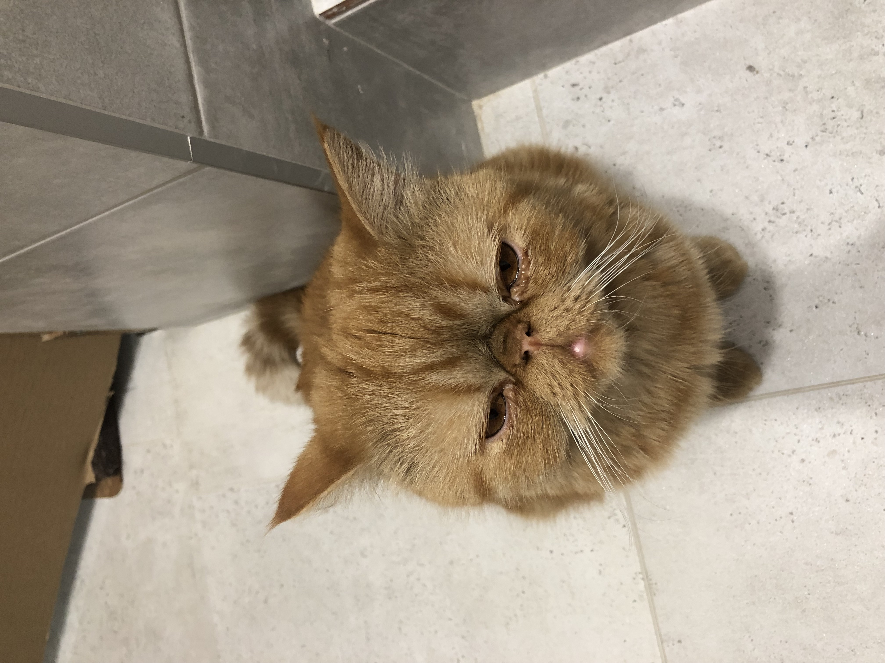

# Инструкция для работы с markdown

## Выделение текста 

Чтобы выделить текст курсивом, необходимо обрамить его звездачками (*) или (_)
например 
*вот так*

_вот так_

Чтобы выделить текст полужирным, необходимо обрамить его жвойными звездачками (**) например **Вот так** 

или знаком нижнего подчеркивания (__)
Пример: __вот так__

Альтернативный способ выделения текста жирным или курсивом нужен для того чтобы мы могли использовать оба этих способа.
Например:

_текст может быть выделен курсивом и **быть полужирным**_

## Списки
Чтобы добавить не нумерованные списки необходимо пункты выделить звездочкой.(*)
пример: 
* элемент 1
* элемент 2
* элемент 3 

Чтобы выделить нумерованные списки, необходимо просто пронумировать. 
пример: 

1. первый пункт
2. второй пуект
3. третий пункт

## Работа с изображениями 

Чтобы вставить изображение в текст необходимо сделать следующее:
*(сначало мы ставим восклицатеотный знак а пото в кводратных скобках мы укажем тот текст который будет выводиться если изображение не загрузится а затем в круглых скобках укажим имя вайла из которого не обходимо это изображение достать)*

 

## Ссылки

## Работа с таблицами 

## Цытаты 

## Заключение 